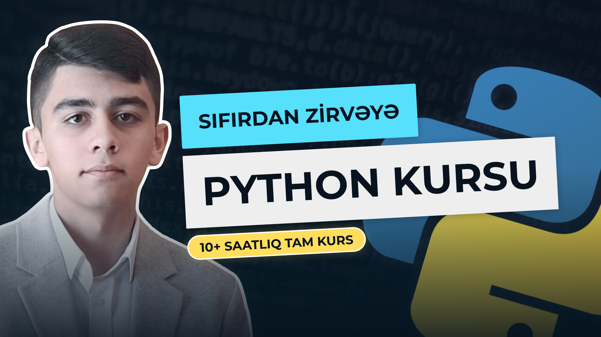

# 🐍 Sıfırdan Zirvəyə: Python Proqramlaşdırma Kursu

🚀 Proqramlaşdırmaya başlamaq istəyirsən? Bu kursla arzularını gerçəkləşdir! 📚 Tamamilə Azərbaycan dilində olan bu kurs Python proqramlaşdırma dilini sıfırdan öyrədir və səni mütəxəssis səviyyəsinə qədər aparır. Sadəcə bir videoda 10+ saatlıq dərslərlə yeni biliklər qazan, layihələr yarat, və proqramçı karyerana güclü başlanğıc et! 💻

### 📌 Kursda Nələr Öyrənəcəksiniz?

- Python-un əsasları 🐍
- Data strukturlar: List, Tuple, Set, Dictionary 📂
- Dövrlər və Şərtlər 🔄
- Funksiyalar və Lambda istifadəsi 🔧
- OOP (Object-Oriented Programming) və irsiyyət 📦
- Exception handling və File Handling 📜
- Proqramlaşdırma texnikaları və praktik nümunələr! 💡

### 🎯 Kurs Kimlər Üçündür?

Həm yeni başlayanlar, həm də biliklərini təkmilləşdirmək istəyənlər üçün! ✅
